# GridSight 🏎️

**Professional F1 Telemetry Dashboard** — A real-time pit wall experience
for F1 fans and sim racers. Replay any session from 2022–2026, connect
live to EA F1 25, or follow real race weekends via SignalR.

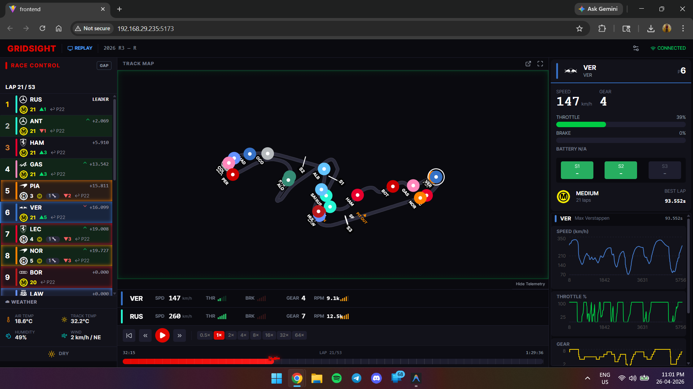

---

## ✨ Features

- 🗺️ **Live Track Map** — Canvas-rendered circuit with all 22 drivers, sector markers, pit lane, and flag overlays
- 📊 **Telemetry Charts** — Speed, throttle, brake, and gear traces per driver (Recharts)
- 🏁 **Leaderboard** — Gaps to leader, tyre compound, stint age, pit stop count, sector times, and pit window prediction
- 🌦️ **Weather HUD** — Air/track temperature, humidity, wind speed & direction
- 🚦 **Race Control** — Safety car, VSC, red flag banners, and race director messages
- 🎮 **F1 25 UDP Bridge** — Live sim telemetry from EA F1 25 (port 20777)
- 📡 **SignalR Live Timing** — Real F1 race weekend data straight from the official feed
- 📱 **Mobile Layout** — Full 4-tab responsive UI (Track · Grid · Data · Weather)
- 🖼️ **Picture-in-Picture** — Detachable floating window with track map + live telemetry
- 📅 **2022–2026 Seasons** — Ground Effect era (2022–2025) and Active Aero era (2026)
- ⏺️ **Session Recording** — Record and replay F1 25 sim sessions
- ⚡ **Precompute CLI** — Batch-cache sessions for instant loading

---

## 📸 Screenshots

### Session Selector
> Era-grouped year buttons, grand prix dropdown, practice/quali/race picker,
> F1 25 simulator launcher, and saved sim session replay.

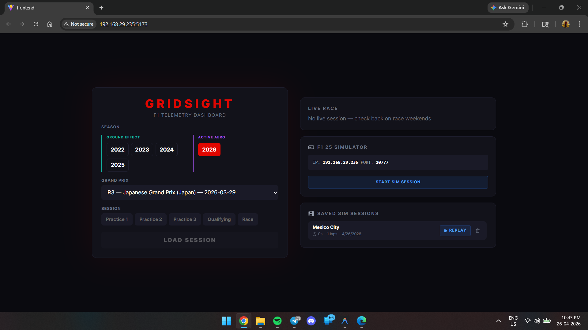

### Leaderboard
> Gaps, tyre compounds with stint age, position deltas, pit stop indicators,
> and pit window predictions for the full 22-driver grid.

<p align="center">
  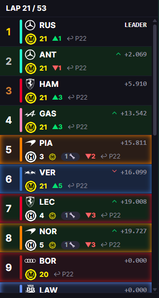
  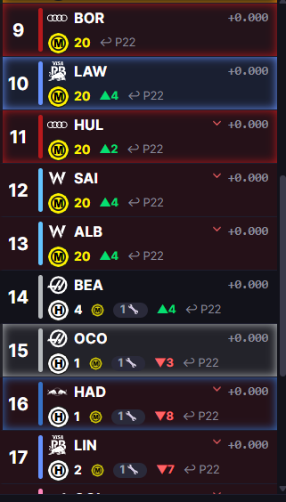
  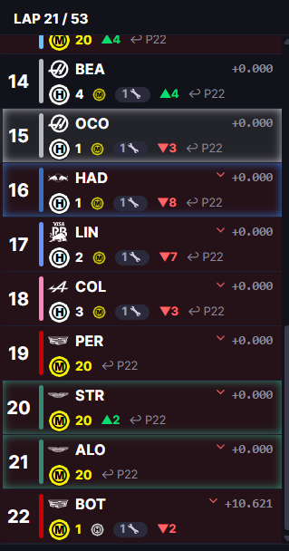
</p>

### Telemetry Panel
> Driver info card with live speed/gear/throttle/brake readout, sector times,
> tyre compound, and full speed/throttle/gear/brake chart traces.

<p align="center">
  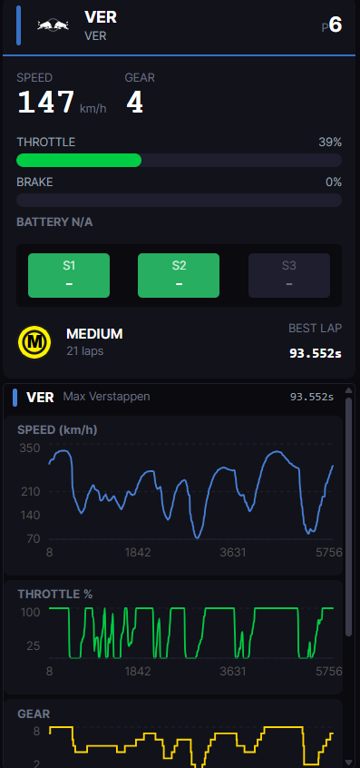
  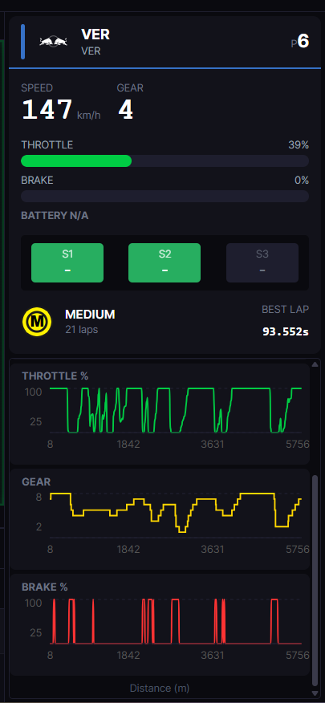
</p>

### Weather & Race Control

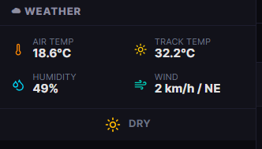

### Picture-in-Picture

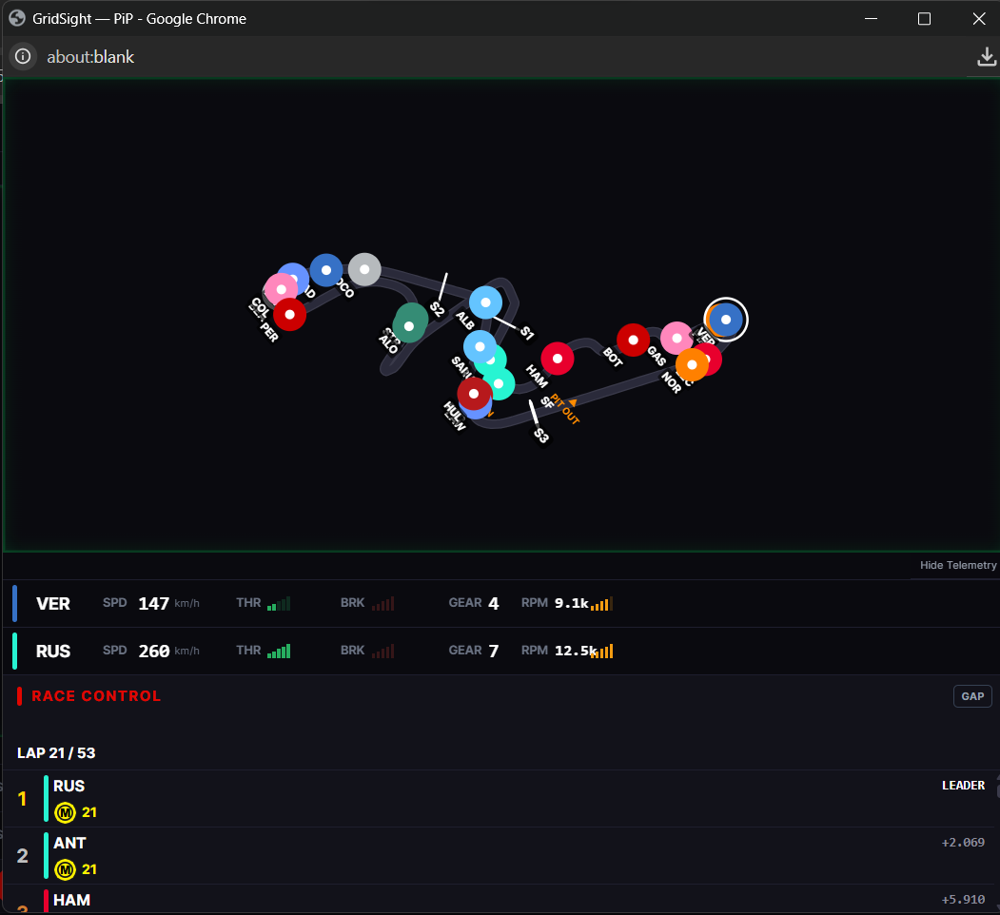

### Mobile — F1 25 Live

<p align="center">
  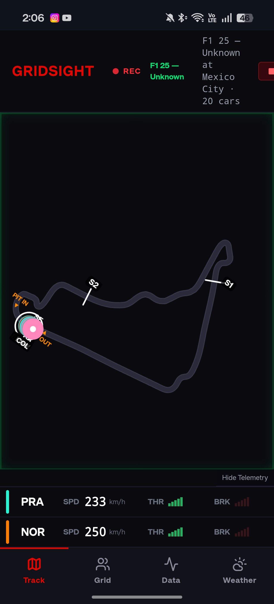
  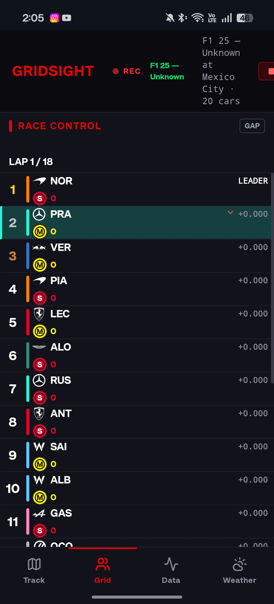
  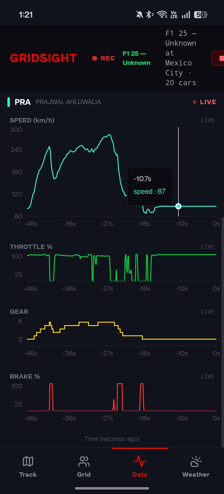
</p>

### Mobile — Replay Leaderboard

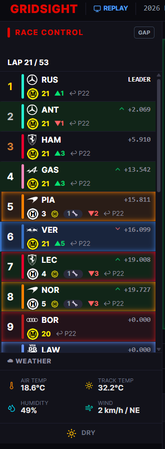

---

## 🛠️ Tech Stack

| Layer | Technology |
|-------|-----------|
| Backend | Python 3.10, FastAPI, WebSockets |
| F1 Data | FastF1 3.8.x |
| Live Timing | SignalR (official F1 feed) |
| Frontend | React 18, TypeScript, Vite, Tailwind CSS, Zustand, Recharts |
| Sim Data | EA F1 25 UDP (port 20777) |

---

## 🚀 Quick Start

### Backend
```bash
cd backend
pip install -r requirements.txt
uvicorn main:app --reload --host 0.0.0.0 --port 8000
```

### Frontend
```bash
cd frontend
npm install
npm run dev
```

Open **http://localhost:5173**

---

## 🎮 F1 25 Integration

1. Start GridSight backend
2. In F1 25: **Settings → Telemetry → UDP On** → IP: `[your PC's IP]` → Port: `20777`
3. Click **START SIM SESSION** on the GridSight home screen
4. Drive — telemetry streams live to the dashboard

---

## ⚡ Precompute Sessions *(optional but recommended)*
```bash
cd backend
python utils/precompute.py --year 2025
python utils/precompute.py --session 2026 3 R
```
Pre-caches session data so replays load instantly instead of fetching from FastF1 on demand.

---

## 🏗️ Project Structure
```
GridSight/
├── backend/
│   ├── api/           # FastAPI routers (sessions, laps, replay, live, live_f1)
│   ├── core/          # Business logic (f1_data, replay_engine, cache, pit prediction, live bridge)
│   ├── data/          # Static data (pit_loss.json)
│   ├── models/        # Pydantic schemas
│   ├── tracks/        # Racing line coordinates for track map rendering
│   ├── utils/         # Precompute script
│   └── main.py        # App entrypoint
├── frontend/
│   └── src/
│       ├── components/ # React components (trackmap, leaderboard, telemetry, controls, layout, overlays)
│       ├── hooks/      # WebSocket hooks (replay, live sim, live F1)
│       ├── store/      # Zustand state stores
│       ├── assets/     # Team logos (SVG)
│       └── utils/      # Driver colors
└── screenshots/        # App screenshots
```

---

## 🙏 Credits

- [FastF1](https://github.com/theOehrly/FastF1) by theOehrly
- Inspired by [f1-race-replay](https://github.com/IAmTomShaw/f1-race-replay) by Tom Shaw
- F1 25 UDP parsing inspired by [Fredrik2002/f1-25-telemetry-application](https://github.com/Fredrik2002/f1-25-telemetry-application)

## ⚠️ Disclaimer

GridSight is unofficial and is not associated with Formula 1, FIA, or EA Sports.
All F1-related trademarks belong to their respective owners.

**Team Logos** — The team logo SVGs included in `frontend/src/assets/logos/` are
the property of their respective Formula 1 teams and are used here solely for
non-commercial, educational, and fan-project display purposes. If you are a
rights holder and would like a logo removed, please open an issue.

## 📄 License

MIT
